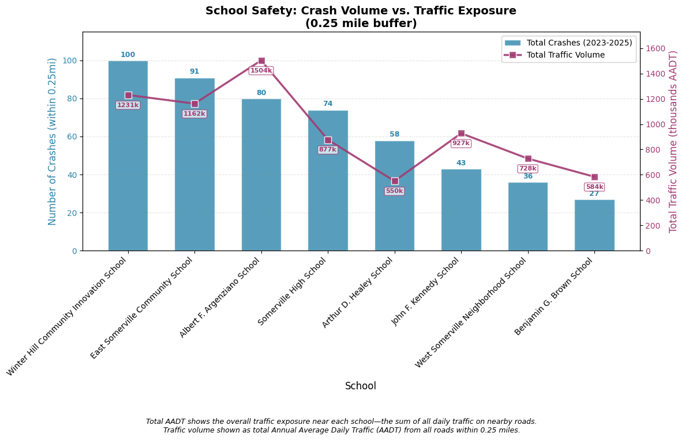
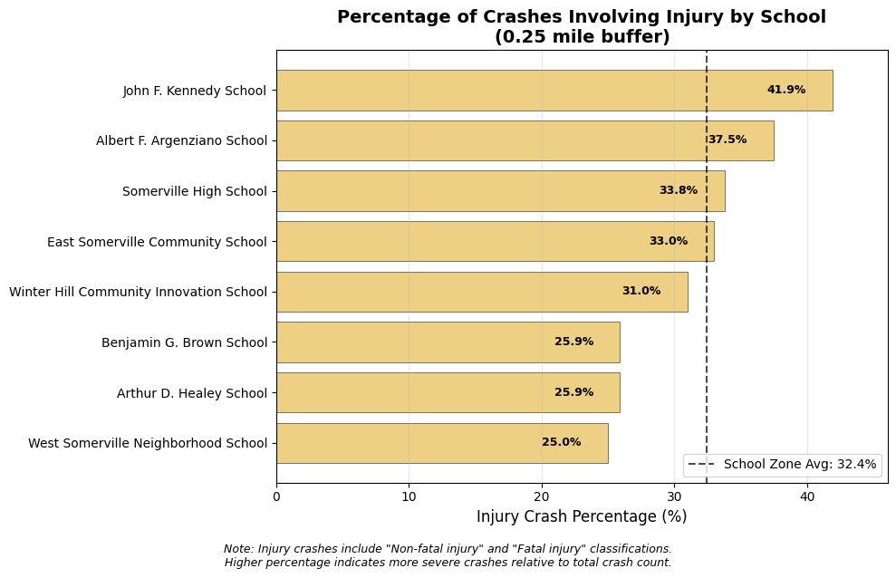

# Somerville School Safety Analysis
## Executive Summary

This project moves beyond simply counting crashes near schools to understanding them in their proper context. By integrating three years of crash data (2023-2025) with traffic volume measurements, we developed a priority framework that answers not just "where do crashes happen?" but "where is the risk highest given how many cars are on the road?"

The resulting priority score combines two critical factors:

 - Crash frequency (weighted 2x) – The raw number of crashes within 0.25 miles of each school

 - Traffic exposure (weighted 1x) – The total daily traffic volume on roads surrounding each school

This approach ensures schools aren't penalized simply because they're located on busy streets, nor are high-crash locations on quiet roads overlooked. Schools like Healey, with its extreme I-93 exposure, reveal concentrated danger that raw crash counts alone would miss. Schools like Argenziano, with the highest total traffic volume, show how dense urban networks create different safety challenges.

The final rankings represent a data-driven consensus between absolute crash numbers and the traffic environment in which they occur. These findings provide a clearer picture of *where* interventions might have the greatest impact.

### Key Findings

- **Winter Hill** and **East Somerville** schools are the top priorities due to high crash counts and traffic exposure
- **Healey School** has a high injury crash rate relative to its traffic, suggesting specific risks near I-93
- **Argenziano School** faces the highest total traffic volume from a dense street network

## Interactive Priority Map

The map below shows school buffers color-coded by priority score (🟢 = low priority, 🌕 = medium, 🔴 = high priority). Hover over any buffer to see detailed statistics for that school.

<iframe src="https://somerville-schools-traffic-safety.streamlit.app/?embed=true" height="700" width="100%" style="border: none; border-radius: 8px; margin: 20px 0;"></iframe>

## Crash Volume vs. Average Street Traffic

This chart compares total crashes (blue bars) with average daily traffic on nearby roads (purple line). Schools with both high crash counts and high average traffic are priorities for intervention.

# Crash vs traffic chart

## Injury Crash Percentage by School

This chart shows the percentage of crashes that resulted in injury at each school. Higher percentages indicate more severe crashes relative to total crash count.

JFK's high injury percentage (42%) tells us that when crashes happen near JFK, they're more likely to be severe. This is a genuine safety concern. However, its low priority score stems from two factors:

1. Low absolute crash count: JFK has only 43 total crashes within 0.25 miles—far fewer than Winter Hill (100), East Somerville (91), or Argenziano (80). Fewer crashes overall means fewer opportunities for injuries to occur, even if each crash carries higher risk.

2. Moderate traffic exposure: JFK's total traffic volume (927,332 AADT) is substantial but not extreme. The priority score weights both crashes and traffic, so schools with both high crash counts AND high traffic volume rank higher.

## Methodology Summary

1. **Data Collection**: Crash data (2023-2025) from MassDOT IMPACT, traffic volumes from MassDOT Road Inventory API
2. **Spatial Analysis**: Created 0.25-mile buffers around 8 selected schools
3. **Metrics**: Delineated crash severity, injury percentages, and total traffic volume per school
4. **Priority Scoring**: Combined crash counts (weighted 2x) with traffic exposure (weighted 1x)
